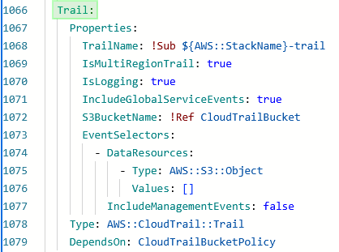

# IAM Policy Q&A - Technical Review

## Overview

Technical questions regarding CloudFormation template review. Security-focused concerns that should be addressed by engineering/development team.

On the list of concerns:

1. Blank IaM access policies
2. Too loose IaM policies
3. Dynamic IaM policies creation
4. CloudTrail configuration
5. Lambda Configuration
6. Network Security

**Sample CloudFormation Template:** [template.cft](./template.cft)

## Security Concerns Identified

### 1. Blank IAM Access Policies

- **Issue:** Policies attached to several IAM roles but don't make sense in current form
- **Question:** What are these policies intended for?

**Evidence:**

- 
- 
- 

They are attached to several IaM roles, but do not seem to make sense in this form.

### 2. Too Loose IAM Policies

- **Issue:** `"Resource: '*'"` being used inappropriately
- **Concern:** Overly permissive access patterns

**Evidence:**

- 
- 

### 3. Dynamic IAM Policy Creation

- `Critical Issue:` These policies for the `AmazonECSTaskExecutionRole` role apparently can be passed by `MigrationLambdaRole` (Lambda) and `TrackingCronRole` (EventBridge).
- **Implication:** Almost any resource could create or modify IAM policies
- **Questions:**
  - Is that true?
  - What are these policies for?
  - Can they be created manually or via CloudFormation instead?

**Evidence:**

- 
- 
- 

### 4. CloudTrail Configuration

**Missing Required Security Features:**

Our security policy requires us to be able to configure:

1. CloudWatch destination:
   - `CloudWatchLogsLogGroupArn`
   - `CloudWatchLogsRoleArn`
2. Trail encryption:
   - (`KMSKeyId`)

How would we do that?

**Evidence:**

- 

### 5. Lambda Configuration

**Question:** The Lambda's Athena permissions use a wildcard, which seems overly broad:

Could it be restricted, as it is here:

- 

### Network Security

1. **ECS Tasks:** Apparently open non-TLS ports (port 80) for incoming connections, even though end-users use ELB which terminates TLS. Our security policy requires all traffic to be encrypted, even on the on-prem networks. Is it possible to enforce TSL everywhere?

2. **ELB Port 444:** What is this needed for? End users may not have access to it due to our proxy/firewall configuration (which is managed by the Security team)

3. **ELB Certificate:** Not defined in the CF template, but must exist in the same region as the deployment. Are we required to create it? Any limitations regarding the DNS name?
