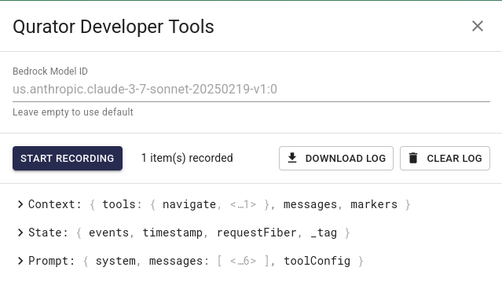

# Quilt Platform Release 1.62.0

This release expands support for the QuiltSync desktop sync client and the Qurator AI chatbot, and addresses a stack name limitation impacting the prior release.  There is also a new version of `quilt3`
that streamlines pushing packages across buckets.

## Catalog Enhancements

### HTTP Redirects for Opening QuiltSync

To support clients that cannot directly open the Quilt+ URIs used by [QuiltSync](https://www.quilt.bio/quiltsync),
we have added a [new `redir` route](https://docs.quilt.bio/quilt-platform-catalog-user/uri#catalog-usage) to the Quilt Catalog.
Appending the URL-encoded `quilt+s3://` URI for a package or path to `https://your-catalog-host/redir/`
generates a standard URL that will redirect to the Quilt+ URI, automatically opening QuiltSync (if installed).

For example: `https://open.quiltdata.com/redir/quilt%2Bs3%3A%2F%2Fquilt-example%23package%3Dakarve%2Fcord19%26path%3DCORD19.ipynb`

### Expanded Qurator Developer Tools

The built-in Developer Tools (available in the upper right menu of the Qurator AI chat window) have been expanded with two new features:

#### Session Recordings

Similar to web inspectors, users can record a portion of their Qurator session,
and then download (or clear) the resulting JSON log.
This is primarily intended for tuning or debugging prompts,
but is also a convenient way to capture structured results.

#### Swappable Models

For the first time, you can modify Qurator to use a different Bedrock Model than the default (currently Claude 3.7). This is particularly useful when you want to experiment with newer, cheaper, or specialized models.

Please note:

1. You must paste in the exact Bedrock Model ID
2. The model (specifically, the inference profile) must be enabled in the same region as your Quilt stack
3. Qurator expects the model to support both text and image inputs, and may not function with less capable models.

### Support for More Stack Names

The new `EsIngestBucket` introduced in 1.61 to support advanced package searches was incompatible with certain stack names.
That limitation has been removed, so all customers can now safely upgrade.

### Other Improvements

- Users can now use the keyboard to enter dates for faceted search filters
- Searches are less likely to experience timeouts when searching large indices on small clusters
- Search filters handle invalid input more gracefully
- Secure search performs better under high load

## Version 7.0 of quilt3 Python SDK

The latest version of `quilt3` adds a new default `selector_fn`
to the package push command.  This ensures that, unless you specify otherwise, pushing a package to a new bucket does *not* copy all the files from the current bucket.

Changing the existing behavior requires updating the major version number. Many dependency checkers will not automatically update to a new major version, so you may need to manually bump the version to take advantage of this new functionality.

