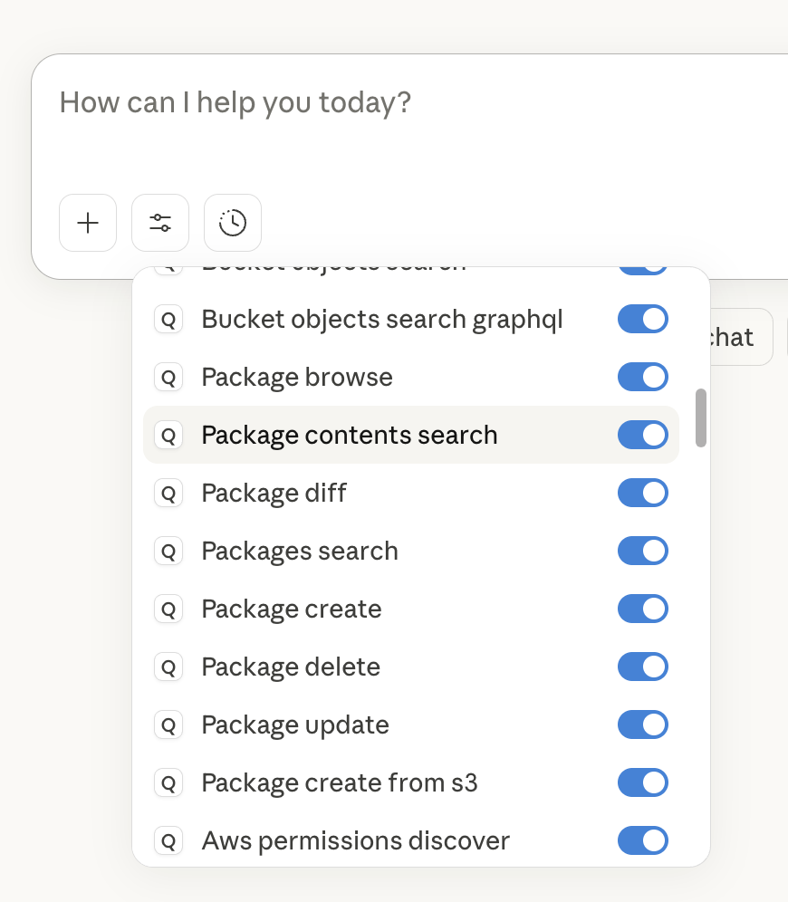
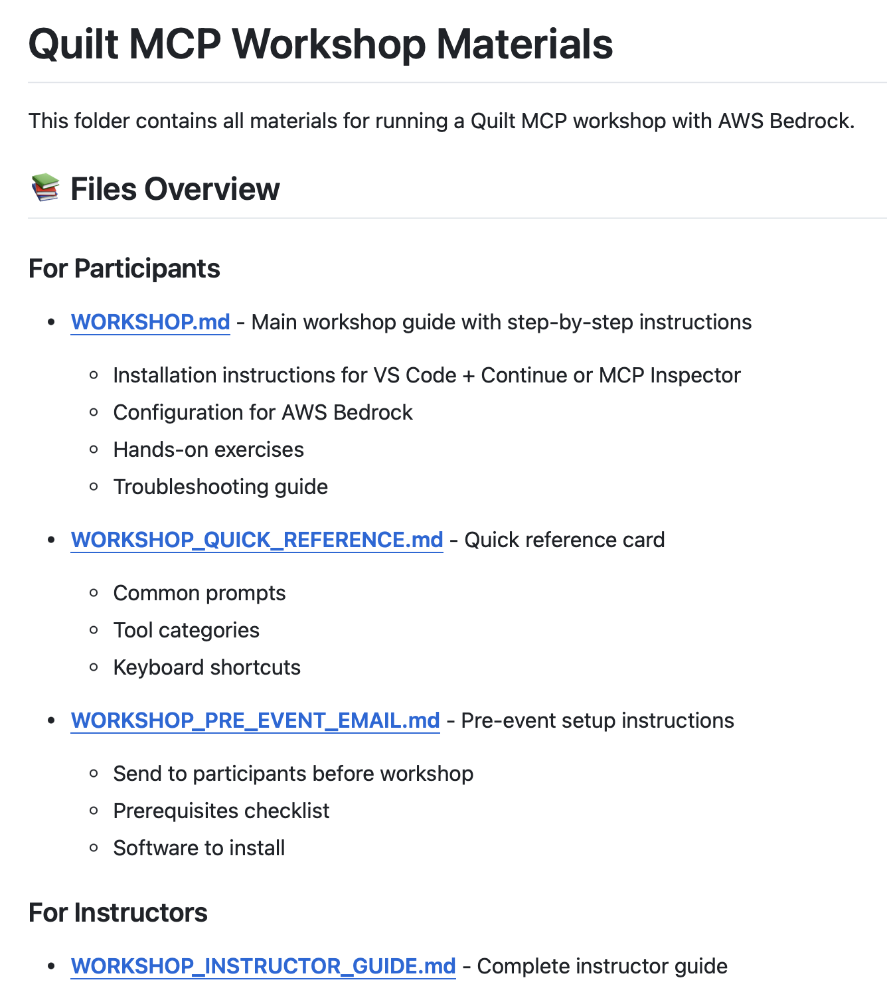
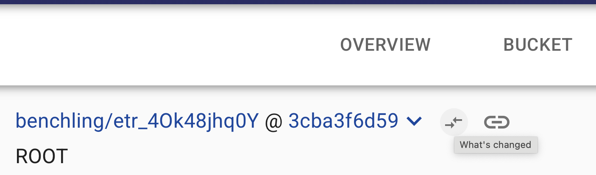
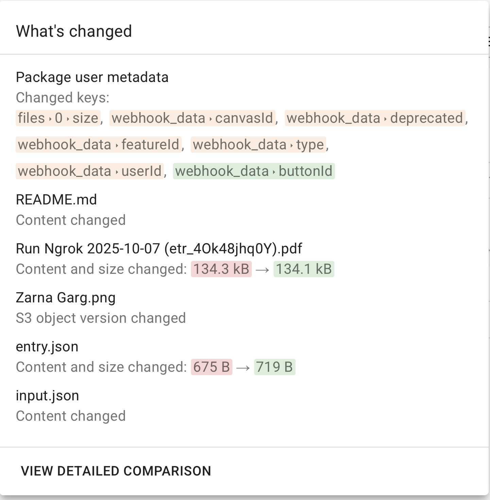
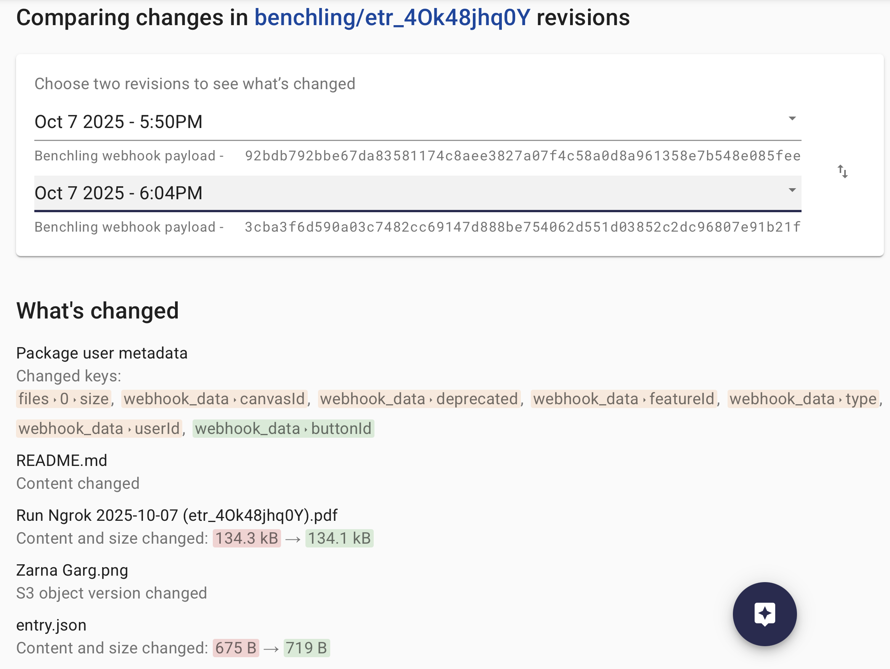
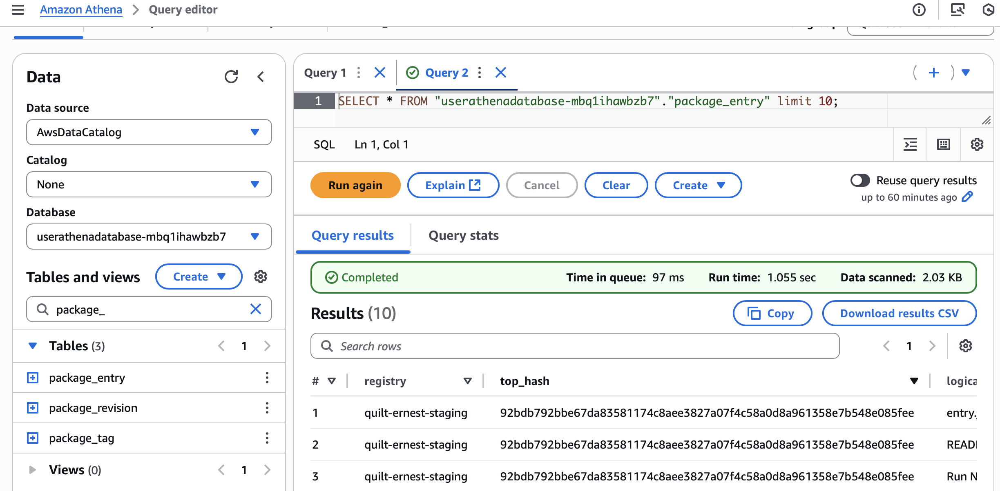

# Quilt Platform Release 1.64.0

## From the [RC CHANGELOG](https://github.com/quiltdata/deployment/pull/2176/files#diff-06ee5dbd187ec4e5b38a42594456cb3c81699d4398919ebf1933765dcaa1c9fb)

This release strengthens Quilt's position as the front door for AI science, with integrations for Model Context Protocol, Benchling, and Iceberg; Qurator AI context enhancements; and visual package diffs.

## Quilt MCP Server

- **MCP Server Package**

  Quilt is excited to pre-release an open source Model Context Protocol server via the [`quilt-mcp` package](https://pypi.org/project/quilt-mcp/), including comprehensive tools for:

  - creating rich packages, complete with auto-generated metadata, READMEs, summaries, and visualization
  - searching, querying, and browsing packages
  - setting up and using generic metadata templates
  - configuring and querying Tabulator tables
  - managing users and roles (if a Quilt admin)

  

  Because Quilt does not charge per-seat licensing, the MCP server (like the Quilt Catalog) is available freely via SSO, with appropriate permissions, to anyone in your organization.

- **Tabulator Configuration by Non-Admin Users**

  To support the MCP Server, this release extends Tabulator configuration for use by non-Admins.
  Users with write access to a bucket can now configure tabulator tables without needing admin privileges, allowing any chatbot user to quickly setup cross-package analyses of tabular data.

- **Quilt MCP Workshop**

  To help you start doing AI Science on AWS Bedrock, Quilt has produced a [2-hour workshop](https://github.com/quiltdata/quilt-mcp-server/tree/main/workshop), including:

  - **Setup** to configure Claude and Quilt MCP for use with [VS Code](code.visualstudio.com) + [Continue](https://www.continue.dev) extension or [MCP Inspector](https://modelcontextprotocol.io/docs/tools/inspector)
  - **Four structured exercises**: Explore data, query with Athena, create visualizations, and build complete analysis packages
  - **Quick reference cards** for common prompts and tool categories

  

  The workshop teaches participants to use natural language with Claude to query S3 data, run Athena queries, generate visualizations, and create shareable Quilt packages — all while keeping data securely within their AWS infrastructure. We provide a complete teaching guide with timeline, troubleshooting tips, and email templates; [contact us](mailto:support@quilt.bio) if you'd like help hosting a workshop at your company.

## New Catalog Features

- **Visual Revision Diffs**
  Quilt has always made it easy to track multiple versions of your packages and the data inside them. Now you can quickly see what has changed between revisions. Use the new double-arrow icon:

  

  To quickly view What's Changed from the previous version:

  

  Or view the Detailed Comparison to see the exact diff between any two revisions:

  

- **External Iceberg Access to Package Information**
  Quilt package information is accessible as an Iceberg data catalog, enabling high-performance, low-cost SQL-based querying of packages and entries to external users (e.g., Athena, DataBricks, Snowflake). See [the documentation](https://docs.quilt.bio/quilt-platform-administrator/advanced/iceberg-tables) for more details.

  
  
  NOTE: Access to Iceberg from inside the Quilt catalog is planned for a future release.

- **Update Package From Bucket**
  Users can now create or revise packages directly from selected S3 files in the bucket browser. Simply select files or directories from the bucket view, and Quilt will automatically resolve directories to their contained files. This streamlined workflow supports complex file paths including special characters, making it easier to build packages from existing S3 data without manual file entry.

## Qurator Enhancements

- **Qurator Auto-Context Loading**
  Qurator now automatically loads context files (AGENTS.md and README.md) and package metadata from the current and parent locations, providing richer context for AI-assisted data exploration without manual setup.

- **Improved Qurator Tool Message Styling**
  Tool messages in Qurator conversations feature enhanced visual styling for better readability and a more polished user experience.

- **Enhanced Qurator Context Management**
  Qurator now intelligently limits search results context to 100k characters, preventing context window overflow and ensuring more reliable AI responses for large datasets.

## Other Improvements

- Fixed an issue that prevented package creation from directories containing hash characters (`#`) in their names.

- Fixed search results and package listings to link directly to the "latest" package revision, so it is easier to edit files.

- Enabled circuit breakers when deploying ECS services, so that deployments fail quickly if the container fails health checks.
  > EP: Does this matter for anyone other than us?
