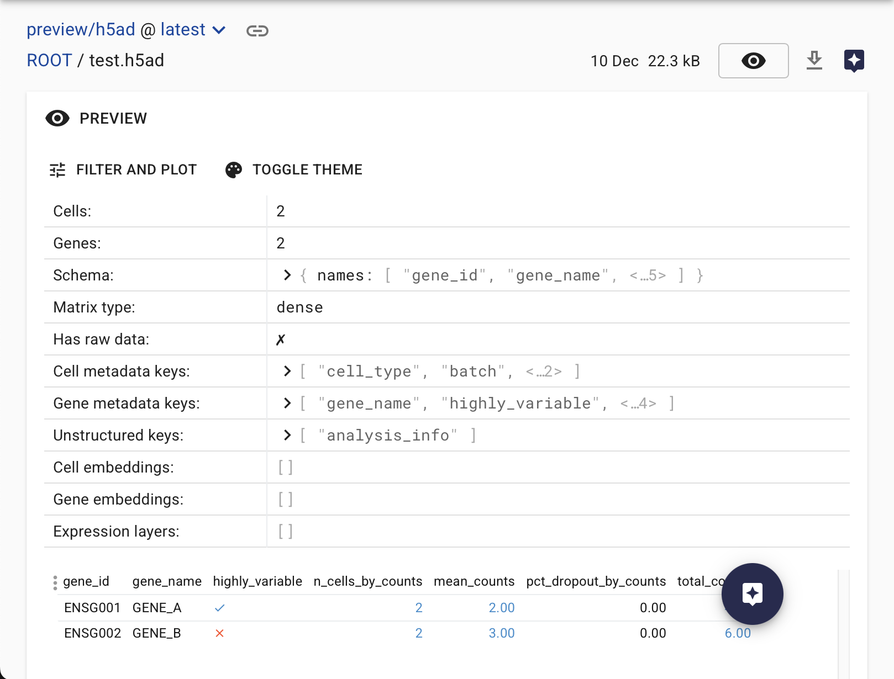
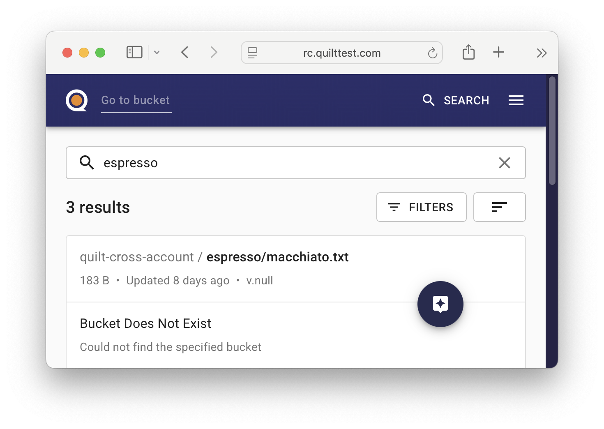
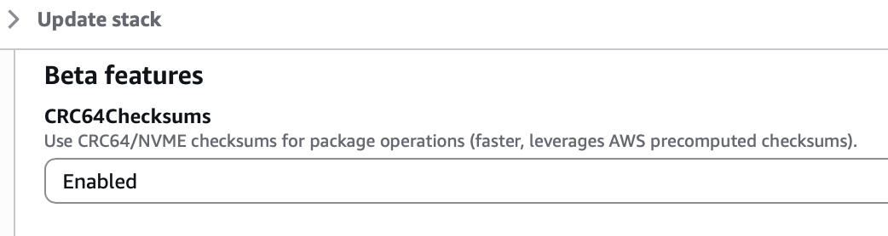

# Quilt Platform Release 1.65.0

This release brings experimental support for AWS-native CRC64/NVMe checksums, HDF5-based file formats, and quality of life improvements across the platform.

## New Quilt Platform Features

### AnnData (`.h5ad`) File Preview

Quilt now supports previewing **AnnData files** directly in the Catalog. [AnnData](https://anndata.readthedocs.io/en/stable/) is a widely used **data model** for annotated matrices, particularly in [single-cell genomics](https://www.nature.com/articles/nmeth.3862). The associated [`.h5ad` file format](https://anndata.readthedocs.io/en/latest/fileformat-prose.html) is an [HDF5](https://www.hdfgroup.org/solutions/hdf5/)-based serialization that enables efficient storage and exchange of AnnData objects.

#### Tabular Metadata View

The preview displays file-level metadata in a new, unified table design shared with [Parquet](https://parquet.apache.org/) and Quilt package previews. For small files it will also show a table of QC metrics.

### Prefix-Scoped Bucket Access

Quilt now supports adding buckets where users only have access to specific prefixes. Previously, buckets required root-level permissions for Quilt to perform validation checks. With this update, administrators can configure prefix-scoped access via the `quilt3.admin` API, enabling teams to *search* on shared or multi-tenant buckets (though they cannot yet be browsed).

> NOTE: The graphical Admin Settings in the Quilt Catalog does not yet support adding prefix-scoped buckets, so you will get a `Permission denied: ListObjectsV2 failed for bucket ... at bucket root`.

### CRC64/NVMe Checksum Support (Experimental)

Packages can now optionally use AWS-native CRC64/NVMe checksums instead of SHA256.
This leverages S3's built-in checksum capabilities
for improved performance of 10x or more when packaging large files that are already in an S3 bucket.
This feature is opt-in and requires enabling the `CRC64Checksums` stack paramter.

### Tabulator CSV Handling

Improved CSV validation to handle files with extra columns. When headers are present, columns are matched by name; otherwise by position. This makes Tabulator more flexible when working with CSVs that have additional columns not defined in the schema.

## New Python SDK Features

### Bucket Management API

The `quilt3` Python SDK now includes a complete API for programmatic bucket management through the new `quilt3.admin.buckets` module. Administrators can now register, configure, and manage S3 buckets in Quilt entirely through code, including support for prefix-scoped bucket access.

The new module provides functions to add, retrieve, update, and remove bucket configurations with comprehensive error handling. This complements the existing graphical Admin Settings interface and enables automation of bucket management workflows. See the [Admin API documentation](https://docs.quilt.bio/quilt-platform-administrator/admin-1) for details.

## Maintenance

- PostgreSQL upgraded to version 15.15 for CloudFormation deployments.
- Several Lambda functions upgraded to work with Python 3.13 runtime.
