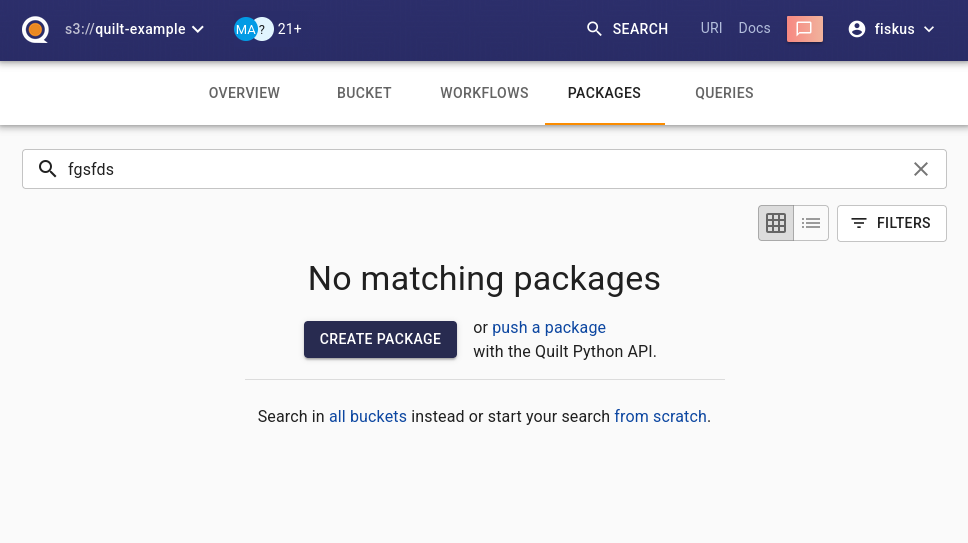
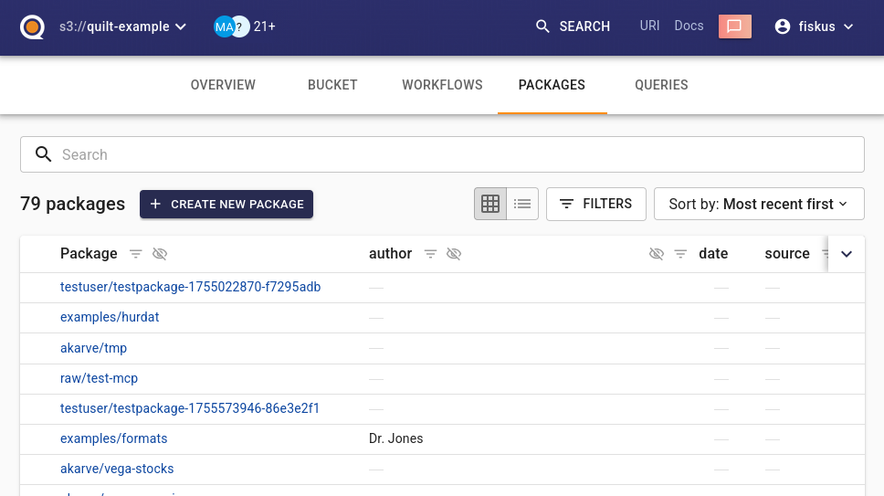
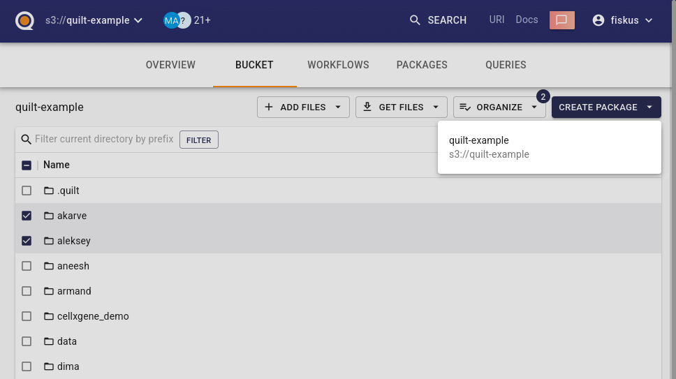
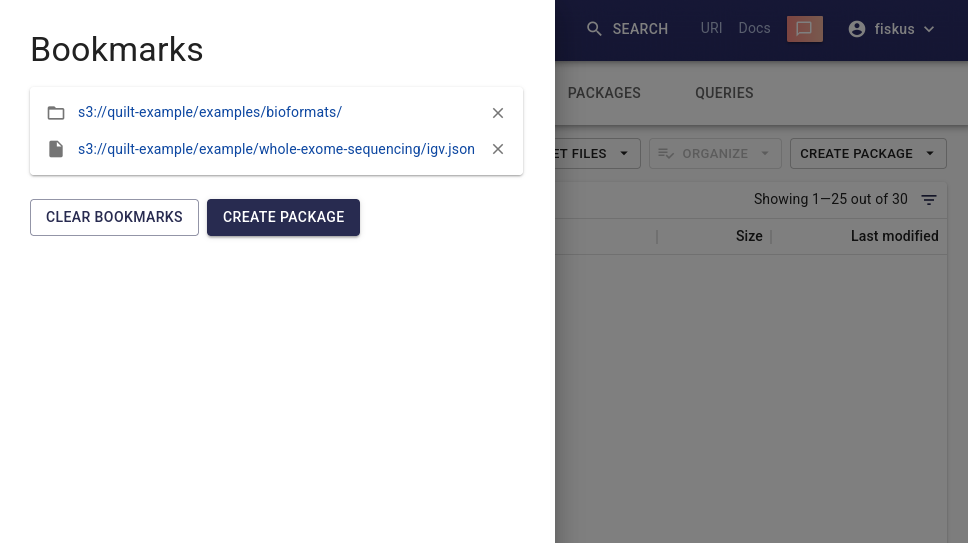
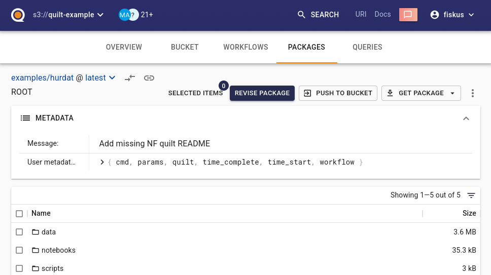
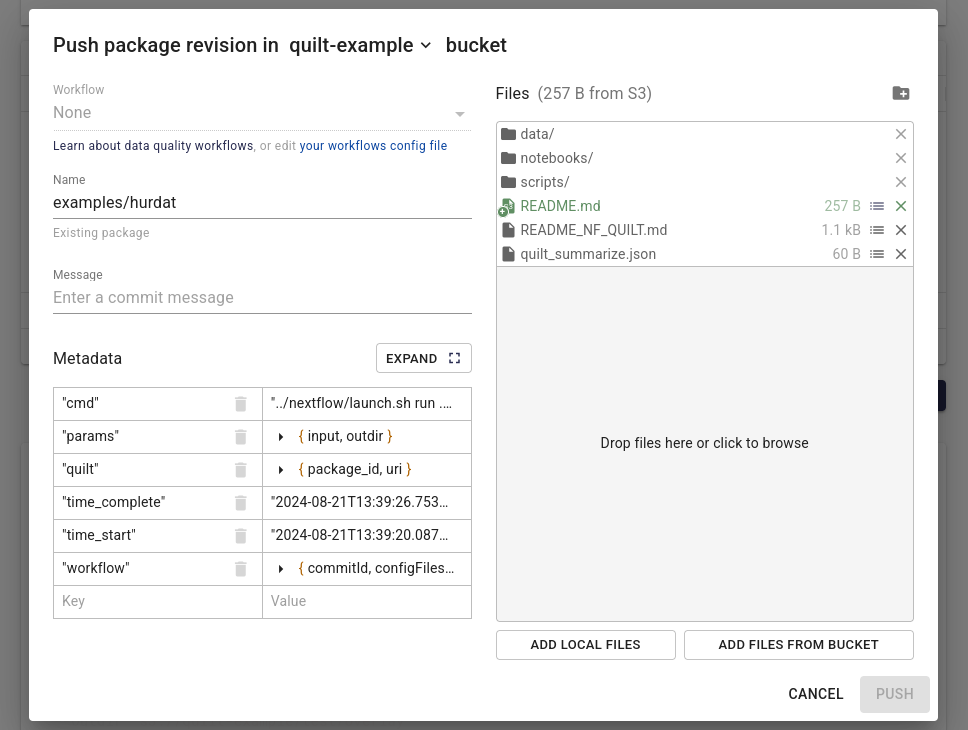
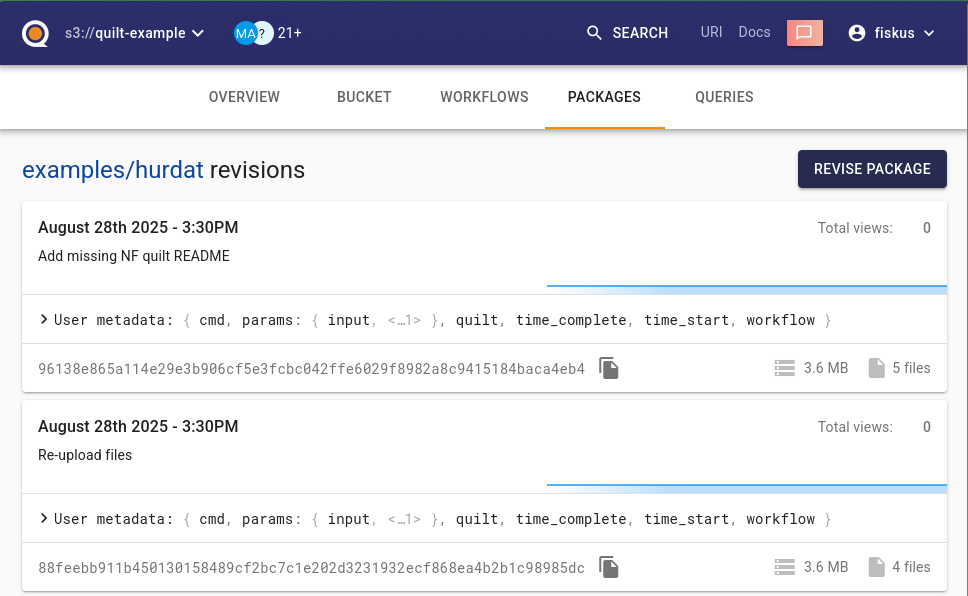

# Catalog Package Dialog

**All dialogs require:** Destination bucket

## New Package From Scratch

### Empty packages list
"No matching packages" message with create button

https://nightly.quilttest.com/b/quilt-example/packages/?q=fgsfds



**Input:**
- Destination bucket

### Package list directory
From embedded search page view within packages list

https://nightly.quilttest.com/b/quilt-example/packages/



**Input:**
- Destination bucket

## New Package With Pre-Selected Content

### From selected S3 files in a Bucket
Create package with selected files/directories (directories resolve to file lists)

https://nightly.quilttest.com/b/quilt-example/tree/



**Input:**
- Destination bucket
- List of selected S3 files or directories

**Test files tree:**
```
bucket/
├── root-file.txt
├── test/ with / # complex ! /path.txt
└── nested/
    ├── level1-file.txt
    └── deep/
        ├── level2-file.txt
        ├── level3-file.txt
        └── deeper/
            └── level4-file.txt
```

### From Athena search results
Create package with found search entries

**Input:**
- Destination bucket
- List of files from Athena search results (used as is, without additional resolving work)

*Note: Athena search results rows that are not valid S3 files are discarded (user confirmation required in such cases)*

### From Bookmarks
Create package with bookmarked files (directories resolve to contained files)



**Input:**
- Destination bucket
- List of bookmarked S3 files or directories

The same test cases as in "From selected S3 files in a Bucket"

## Revise Existing Package

*Note: If users enter the name of an existing package, every package dialog from previous sections becomes "Revise existing package" dialog*

### Package page
From package directory or root ("/") directory with pre-uploaded manifest

https://nightly.quilttest.com/b/quilt-example/packages/examples/hurdat



**Input:**
- Source: bucket, name and hash of the current package
- Destination: bucket and name

### URL parameters on a package page
`/package/add?logicalKey=s3://file-url.ext&logicalPrefix=s3://directory-url/` on package root page

https://nightly.quilttest.com/b/quilt-example/packages/examples/hurdat/add?README.md=s3://quilt-example/README.md



**Input:**
- Source: bucket, name and hash of the current package
- Destination: bucket and name
- File/directory mapping:
  - Individual files: logical key → S3 file URL
  - Directories: logical prefix → S3 directory URL (each file in the S3 directory gets a logical key by joining the logical prefix with the file's relative path from the S3 directory)

**Test query string URL:**

Taking into account the files tree from "From selected S3 files in a Bucket":

```ts

const lkNested = ['nested', ' # logical ! ', 'key.txt'].map(encodeURIComponent).join('/')
const lkRoot = encodeURIComponent('becomes-root.txt')
const lkPrefix = ['change', 'prefix'].map(encodeURIComponent).join('/')

const pkNested = 's3://fiskus-us-east-1/' + ['test-selection', 'root-file.txt'].map(encodeURIComponent).join('/')
const pkRoot = 's3://fiskus-us-east-1/' + ['test-selection', 'test', ' with ', ' # complex ! ', 'path.txt'].map(encodeURIComponent).join('/')
const pkPrefix = 's3://fiskus-us-east-1/' + ['test-selection', 'nested', 'deep/'].map(encodeURIComponent).join('/')

`add?
   ${lkNested}=${encodeURI(pkNested)}&
   ${lkRoot}=${encodeURI(pkRoot)}&
   ${lkPrefix}=${encodeURI(pkPrefix)}`
```

Practical example:

```
https://nightly.quilttest.com/b/fiskus-us-east-1/packages/fiskus/test-selection-2025-10-27/add?nested/%20%23%20logical%20!%20/key.txt=s3://fiskus-us-east-1/test-selection/root-file.txt&becomes-root.txt=s3://fiskus-us-east-1/test-selection/test/%2520with%2520/%2520%2523%2520complex%2520!%2520/path.txt&change/prefix=s3://fiskus-us-east-1/test-selection/nested/deep/
```

### Package revisions page
Revise existing package (similar to package view page)

https://nightly.quilttest.com/b/quilt-example/packages/examples/hurdat/revisions



**Input:**
- Source: bucket, name
- Destination: bucket

## Copy Package

### Package page
Copy the contents of the package to the successor bucket without ability to modify the files

**Input:**
- Source: current package (bucket, name, hash)
- Destination: selected bucket and current package name
